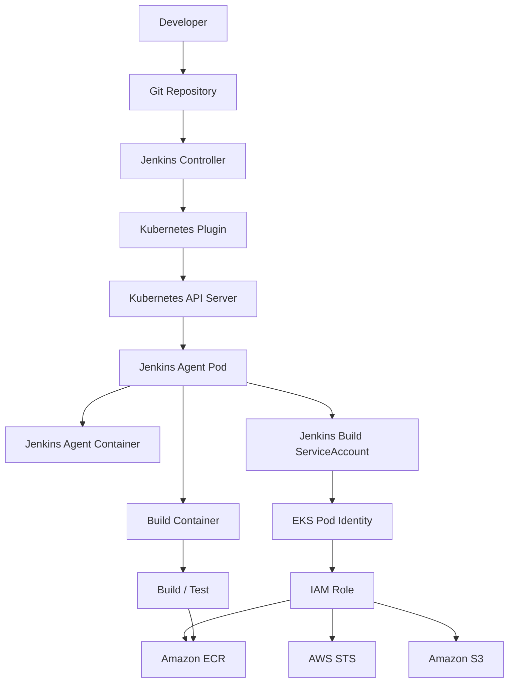
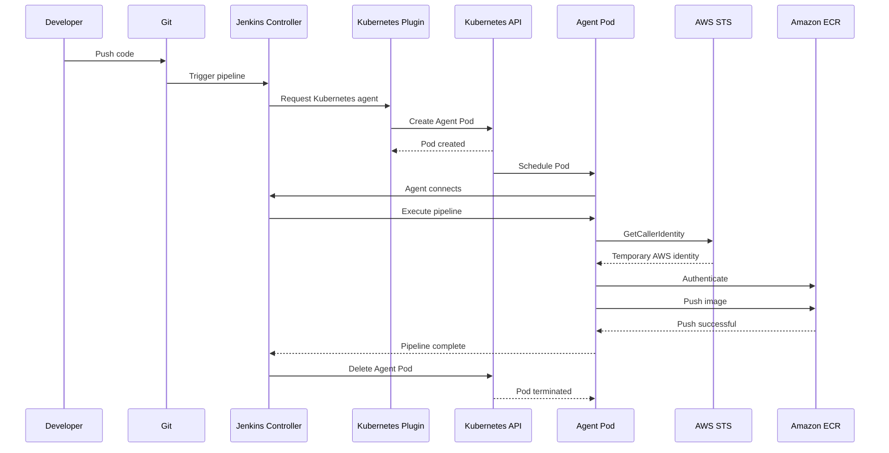

# Jenkins Controller + Dynamic Kubernetes Agents on Existing EKS

## 0. What we already have

We are starting with:

* EKS cluster already running
* Jenkins Controller already running inside EKS
* Jenkins UI accessible
* We are **not** creating the EKS cluster
* We are **not** installing Jenkins from scratch
* The objective is to make Jenkins execute builds on **temporary Kubernetes Pods**
* AWS authentication must use **IAM roles**, not access keys
* Agents should be ephemeral
* Cross-account access should use `sts:AssumeRole` 

The target architecture is:

```text
                         Developer
                             |
                             v
                    +------------------+
                    | Jenkins UI       |
                    +--------+---------+
                             |
                             v
                    +------------------+
                    | Jenkins          |
                    | Controller Pod   |
                    |                  |
                    | Orchestration    |
                    | Pipelines        |
                    +--------+---------+
                             |
                             | Kubernetes Plugin
                             v
                    +------------------+
                    | Kubernetes API   |
                    | Server           |
                    +--------+---------+
                             |
              +--------------+--------------+
              |              |              |
              v              v              v
        +-----------+  +-----------+  +-----------+
        | Agent Pod |  | Agent Pod |  | Agent Pod |
        | Build #1  |  | Build #2  |  | Build #3  |
        +-----+-----+  +-----+-----+  +-----+-----+
              |              |              |
              +--------------+--------------+
                             |
                       Kubernetes SA
                             |
                             v
                    EKS Pod Identity
                         / IRSA
                             |
                             v
                       IAM Role
                             |
              +--------------+--------------+
              |              |              |
              v              v              v
             ECR            S3             STS
```

The Kubernetes plugin provisions Jenkins agents as Kubernetes Pods and supports ephemeral Pod templates. ([Jenkins Plugins][1])

---

# 1. First understand Controller vs Agent

This is the most important concept.

## Jenkins Controller

The Controller is responsible for:

```text
Pipeline orchestration
Job scheduling
Pipeline configuration
Credentials/configuration management
Build history
Jenkins UI
Plugin management
```

It should **not** normally perform:

```text
docker build
terraform apply
npm build
mvn package
kubectl apply
aws ecr push
```

Instead:

```text
Controller
    |
    | "I need an agent"
    v
Kubernetes Plugin
    |
    v
Kubernetes API
    |
    v
Temporary Agent Pod
    |
    v
BUILD
```

---

# 2. What is a Jenkins Agent?

A Jenkins Agent is where the actual build commands execute.

For example:

```text
Agent Pod
|
+-- Jenkins Agent
|
+-- Git
|
+-- AWS CLI
|
+-- Terraform
|
+-- kubectl
|
+-- Helm
|
+-- BuildKit
|
+-- Workspace
```

When the build starts:

```text
Create Pod
     |
     v
Agent connects
     |
     v
Checkout code
     |
     v
Build
     |
     v
Test
     |
     v
Push artifact
     |
     v
Build complete
     |
     v
Delete Pod
```

This is why we call them **ephemeral agents**.

The Kubernetes plugin explicitly supports dynamic Pods and automatically handles agent allocation/cleanup. ([Jenkins Plugins][1])

---

# 3. Why Kubernetes Agents?

Suppose we have 100 builds.

Without Kubernetes agents:

```text
                 Jenkins Controller
                 |
       +---------+---------+
       |         |         |
     Build1    Build2    Build3
```

The Controller becomes overloaded.

With Kubernetes:

```text
                 Jenkins Controller
                       |
                 Kubernetes Plugin
                       |
       +---------------+---------------+
       |               |               |
       v               v               v
    Agent-1         Agent-2         Agent-3
    Build 1         Build 2         Build 3
```

And after completion:

```text
Agent-1 --> deleted
Agent-2 --> deleted
Agent-3 --> deleted
```

Benefits:

* Build isolation
* Better scalability
* Clean environments
* Different tools per build
* No tool pollution on Controller
* Parallel builds
* Automatic cleanup

---

# 4. One important identity distinction

We actually have **two different Kubernetes identities**.

This is extremely important.

## Identity 1 — Controller ServiceAccount

Used by:

```text
Jenkins Controller
        |
        v
Kubernetes Plugin
        |
        v
Kubernetes API
```

Its purpose is:

```text
create Pods
watch Pods
delete Pods
read Pod status
read logs
exec where required
```

Therefore this identity needs Kubernetes RBAC.

---

## Identity 2 — Agent ServiceAccount

Used by:

```text
Jenkins Agent Pod
        |
        v
AWS APIs
```

Its purpose is:

```text
AWS STS
ECR
S3
CloudWatch
EKS
etc.
```

This identity gets an AWS IAM role through:

```text
EKS Pod Identity
```

or:

```text
IRSA
```

The two should not be confused.

```text
Controller SA
     |
     +---- Kubernetes RBAC

Agent SA
     |
     +---- AWS IAM permissions
```

This separation gives us better least privilege.

---

# 5. Step 1 — Install Kubernetes Plugin

Go to:

```text
Jenkins
   |
   v
Manage Jenkins
   |
   v
Plugins
   |
   v
Available plugins
```

Search:

```text
Kubernetes
```

Install the Jenkins Kubernetes plugin.

Depending on Jenkins version, the UI may appear under:

```text
Manage Jenkins
    |
    +-- Plugins
```

and cloud configuration may be under:

```text
Manage Jenkins
    |
    +-- Nodes and Clouds
           |
           +-- Clouds
```

The exact menu names can vary between Jenkins/plugin versions.

The official plugin supports Kubernetes Cloud configuration, Pod Templates, multiple containers, workspace volumes and Pipeline-defined Pods. ([Jenkins Plugins][1])

---

# 6. Verify Kubernetes Plugin

Go to:

```text
Manage Jenkins
    |
    v
Plugins
    |
    v
Installed
```

Search:

```text
Kubernetes
```

You should see the Kubernetes plugin installed.

---

# 7. Step 2 — Check the existing Jenkins namespace

Since Jenkins already exists:

```bash
kubectl get pods -A | grep jenkins
```

For example:

```text
jenkins    jenkins-xxxxxxxxxx-xxxxx    Running
```

Find the namespace:

```bash
kubectl get ns
```

Let's assume:

```text
<JENKINS_NAMESPACE>
```

For examples below I'll use:

```text
jenkins
```

Replace it if your namespace is different.

---

# 8. Check current Jenkins ServiceAccount

Run:

```bash
kubectl get pod -n jenkins
```

Then:

```bash
kubectl get pod <JENKINS_CONTROLLER_POD> \
  -n jenkins \
  -o jsonpath='{.spec.serviceAccountName}'
```

Example:

```text
jenkins
```

This is important.

**Do not create another Controller ServiceAccount blindly if Jenkins already has one.**

First inspect what is currently being used.

---

# 9. Step 3 — Create a dedicated Controller ServiceAccount

If the existing Controller SA is not suitable, create:

```yaml
apiVersion: v1
kind: ServiceAccount
metadata:
  name: jenkins-controller
  namespace: jenkins
```

Apply:

```bash
kubectl apply -f jenkins-controller-sa.yaml
```

Verify:

```bash
kubectl get sa -n jenkins
```

---

# 10. Why not use default?

Avoid:

```text
system:serviceaccount:jenkins:default
```

because the default ServiceAccount can become a shared identity for unrelated workloads.

Instead:

```text
jenkins-controller
```

is clearly associated with:

```text
Jenkins Controller
```

This makes auditing and least-privilege management much easier.

---

# 11. Step 4 — Kubernetes RBAC

Now we need to give the Controller enough permissions to manage Jenkins Agent Pods.

A typical starting point is:

```yaml
apiVersion: rbac.authorization.k8s.io/v1
kind: Role
metadata:
  name: jenkins-agent-manager
  namespace: jenkins
rules:
  - apiGroups: [""]
    resources:
      - pods
    verbs:
      - create
      - delete
      - get
      - list
      - watch

  - apiGroups: [""]
    resources:
      - pods/log
    verbs:
      - get

  - apiGroups: [""]
    resources:
      - pods/exec
    verbs:
      - create

  - apiGroups: [""]
    resources:
      - pods/status
    verbs:
      - get
      - watch

  - apiGroups: [""]
    resources:
      - secrets
    verbs:
      - get

  - apiGroups: [""]
    resources:
      - configmaps
    verbs:
      - get
      - list
      - watch

  - apiGroups: [""]
    resources:
      - services
    verbs:
      - get
      - create
      - delete
```

Then:

```yaml
apiVersion: rbac.authorization.k8s.io/v1
kind: RoleBinding
metadata:
  name: jenkins-agent-manager
  namespace: jenkins
subjects:
  - kind: ServiceAccount
    name: jenkins-controller
    namespace: jenkins
roleRef:
  apiGroup: rbac.authorization.k8s.io
  kind: Role
  name: jenkins-agent-manager
```

Apply:

```bash
kubectl apply -f jenkins-rbac.yaml
```

---

# 12. Why these permissions?

For example:

```yaml
resources:
  - pods
verbs:
  - create
```

means:

> Jenkins can create Agent Pods.

```yaml
verbs:
  - get
  - list
  - watch
```

allows Jenkins to monitor them.

For example:

```text
Pod created
   |
   v
Pending
   |
   v
ContainerCreating
   |
   v
Running
```

The plugin needs to observe these changes.

---

# 13. Don't use cluster-admin

Never simply do:

```yaml
kind: ClusterRoleBinding

roleRef:
  name: cluster-admin
```

just to make Jenkins work.

That gives Jenkins enormous power:

```text
Create/delete almost anything
Read secrets
Modify workloads
Modify RBAC
Modify namespaces
Potentially compromise entire cluster
```

For production:

```text
Least privilege
```

should be the goal.

The exact RBAC permissions should be validated against the plugin features you actually use.

---

# 14. Verify RBAC

Run:

```bash
kubectl auth can-i create pods \
  --as=system:serviceaccount:jenkins:jenkins-controller \
  -n jenkins
```

Expected:

```text
yes
```

Check:

```bash
kubectl auth can-i get pods \
  --as=system:serviceaccount:jenkins:jenkins-controller \
  -n jenkins
```

Expected:

```text
yes
```

Check:

```bash
kubectl auth can-i delete pods \
  --as=system:serviceaccount:jenkins:jenkins-controller \
  -n jenkins
```

Expected:

```text
yes
```

---

# 15. Should Agent Pods run in Jenkins namespace?

You have two common designs.

## Option A — Same namespace

```text
jenkins
|
+-- Controller
|
+-- Agent
|
+-- Agent
```

Simple.

Good for:

* Learning
* Small installations
* Initial implementation

---

## Option B — Dedicated agent namespace

```text
jenkins
|
+-- Controller

jenkins-agents
|
+-- Agent
+-- Agent
+-- Agent
```

This is cleaner for production isolation.

For our learning/demo I'll use:

```text
jenkins
```

for simplicity.

Production can move to:

```text
jenkins-agents
```

with appropriately scoped RBAC.

---

# 16. Step 5 — Configure Kubernetes Cloud

Go to:

```text
Manage Jenkins
   |
   v
Nodes and Clouds
   |
   v
Clouds
   |
   v
Add a new cloud
   |
   v
Kubernetes
```

Depending on Jenkins version you may see:

```text
Manage Jenkins
 -> Clouds
 -> Add Cloud
```

---

# 17. Kubernetes Cloud configuration

Conceptually:

```text
Name:
kubernetes

Kubernetes URL:
https://kubernetes.default.svc

Kubernetes Namespace:
jenkins

Credentials:
<appropriate Kubernetes credential / in-cluster authentication>

Jenkins URL:
http://jenkins.<namespace>.svc.cluster.local:8080
```

If Controller is inside the same cluster, Kubernetes service DNS is normally the easiest communication path.

For example:

```text
http://jenkins.jenkins.svc.cluster.local:8080
```

if:

```text
Service = jenkins
Namespace = jenkins
```

---

# 18. What is Kubernetes URL?

This:

```text
https://kubernetes.default.svc
```

means:

```text
Jenkins Controller
       |
       v
Kubernetes internal DNS
       |
       v
Kubernetes API
```

You can verify:

```bash
kubectl get svc kubernetes
```

---

# 19. What is Jenkins URL?

This is **not** necessarily the public Jenkins URL.

The Agent needs to reach the Controller.

Inside the cluster, something like:

```text
http://jenkins.jenkins.svc.cluster.local:8080
```

may be appropriate.

The Kubernetes plugin documentation specifically requires the Kubernetes Cloud configuration to know how to reach both Kubernetes and Jenkins. ([Jenkins][2])

---

# 20. Jenkins tunnel

Depending on your plugin/configuration, you may see:

```text
Jenkins tunnel
```

Historically this was used for inbound agent communication.

For modern deployments, WebSocket connectivity can simplify networking because the agent can communicate over HTTP(S), particularly when the Controller is already exposed through an HTTP endpoint.

Don't blindly copy old tutorials that require opening arbitrary JNLP ports.

---

# 21. Connection timeout

For example:

```text
Connection Timeout:
30
```

or a higher value depending on environment.

This controls how long Jenkins waits for Kubernetes API operations.

---

# 22. Read timeout

Example:

```text
Read Timeout:
60
```

Increase this if you have:

* Slow API server
* Large clusters
* Network latency

But don't blindly increase timeouts to hide API/network problems.

---

# 23. Pod retention

For production dynamic agents:

```text
Pod Retention:
Never
```

or the equivalent cleanup behavior.

The objective is:

```text
Build complete
      |
      v
Agent deleted
```

The Kubernetes plugin has configurable Pod retention/cleanup behavior. ([Jenkins Plugins][1])

---

# 24. Step 6 — Create Agent Pod Template

Now comes the important part.

A Pod Template describes:

> "What should a Jenkins Agent Pod look like?"

Example:

```text
Agent Pod
|
+-- jnlp
|    |
|    +-- Jenkins agent process
|
+-- build
|    |
|    +-- git
|    +-- shell
|    +-- application build
|
+-- workspace
```

The Kubernetes plugin supports multiple containers within an agent Pod and allows commands to be directed to a specific container using the `container()` Pipeline step. ([Jenkins Plugins][1])

---

# 25. Agent container vs Build container

## Agent container

Example:

```text
jnlp
```

Responsible for:

```text
Jenkins Remoting
Controller <--> Agent communication
```

It doesn't need:

```text
terraform
aws
kubectl
docker
```

---

## Build container

Example:

```text
build
```

contains:

```text
shell
git
aws
kubectl
terraform
helm
etc.
```

This separation is useful because we don't need to install all tools inside:

```text
Jenkins Controller
```

---

# 26. Example Pod Template

A practical starting point:

```yaml
apiVersion: v1
kind: Pod

metadata:
  labels:
    app: jenkins-agent

spec:

  serviceAccountName: jenkins-build

  containers:

    - name: jnlp
      image: jenkins/inbound-agent:<PINNED_VERSION>

    - name: build
      image: <YOUR_BUILD_IMAGE>:<PINNED_VERSION>
      command:
        - sleep
      args:
        - 99d
      tty: true

  volumes:

    - name: workspace-volume
      emptyDir: {}
```

The exact agent image should be pinned rather than relying on an unqualified `latest` tag.

---

# 27. Workspace

The workspace contains:

```text
workspace/
|
+-- source code
+-- build output
+-- temporary files
+-- test reports
```

For simple builds:

```yaml
emptyDir: {}
```

is often enough.

The workspace disappears with the Pod.

That is exactly what we want for ephemeral builds.

The Kubernetes plugin supports `emptyDir`, dynamic PVCs and existing PVCs for workspace management. ([Jenkins Plugins][1])

---

# 28. Why not Persistent Volume for every build?

Because:

```text
Agent = ephemeral
Workspace = ephemeral
```

If you don't need persistent workspace state, don't introduce it.

Instead:

```text
Git
 |
 v
Agent Pod
 |
 +-- workspace
 |
 v
Build
 |
 v
Artifact -> ECR/S3
 |
 v
Pod deleted
```

Artifacts should be stored externally.

---

# 29. Agent Pod lifecycle

Now the entire lifecycle:

```text
Pipeline starts
      |
      v
Jenkins evaluates agent requirement
      |
      v
Kubernetes Plugin
      |
      v
Kubernetes API
      |
      v
Create Pod
      |
      v
Pod Pending
      |
      v
ContainerCreating
      |
      v
Agent connects
      |
      v
Pipeline starts
      |
      v
Checkout
      |
      v
Build
      |
      v
Test
      |
      v
Artifact push
      |
      v
Pipeline complete
      |
      v
Pod deleted
```

---

# 30. What if Pod is Pending?

Run:

```bash
kubectl get pods -n jenkins
```

Example:

```text
NAME                       STATUS
jenkins-xxx                Running
jenkins-agent-abc          Pending
```

Then:

```bash
kubectl describe pod jenkins-agent-abc -n jenkins
```

Look at:

```text
Events:
```

Common reasons:

```text
Insufficient cpu
Insufficient memory
No matching node
Taint
Node selector mismatch
PVC issue
Image pull failure
```

---

# 31. ContainerCreating

Run:

```bash
kubectl describe pod <agent-pod> -n jenkins
```

Potential causes:

```text
ImagePullBackOff
ErrImagePull
VolumeMount error
Secret issue
CNI/networking problem
```

---

# 32. Agent doesn't connect

Check:

```bash
kubectl logs <agent-pod> -n jenkins -c jnlp
```

Also:

```bash
kubectl describe pod <agent-pod> -n jenkins
```

Typical causes:

```text
Wrong Jenkins URL
NetworkPolicy
DNS
TLS
WebSocket configuration
Agent image issue
Controller connectivity
```

---

# 33. Step 7 — AWS Authentication

Now the critical part.

**Do not put this into Jenkins:**

```text
AWS_ACCESS_KEY_ID
AWS_SECRET_ACCESS_KEY
```

No:

```text
Jenkins Credentials
      |
      +-- AWS Access Key
      +-- AWS Secret Key
```

Instead:

```text
Agent Pod
   |
   v
Kubernetes ServiceAccount
   |
   v
EKS Pod Identity
   |
   v
IAM Role
   |
   v
AWS STS
   |
   v
AWS Services
```

AWS currently recommends **EKS Pod Identity whenever possible** for workloads on EKS. IRSA remains a valid alternative. ([AWS Documentation][3])

---

# 34. IRSA vs EKS Pod Identity

## Static access keys

```text
Jenkins
 |
 +-- ACCESS_KEY
 +-- SECRET_KEY
 |
 v
AWS
```

Problems:

* Long lived
* Rotation burden
* Secret leakage risk
* Difficult auditing
* Human handling

Avoid.

---

## IRSA

```text
Pod
 |
 v
ServiceAccount
 |
 v
OIDC
 |
 v
IAM Role
 |
 v
AWS
```

Good and widely used.

AWS documents IRSA as a fine-grained method for associating Kubernetes ServiceAccounts with IAM roles. ([AWS Documentation][4])

---

# 35. EKS Pod Identity

Modern approach:

```text
Pod
 |
 v
ServiceAccount
 |
 v
EKS Pod Identity Association
 |
 v
IAM Role
 |
 v
AWS
```

Advantages:

* EKS-native
* Simplified configuration
* No per-cluster OIDC trust policy management
* IAM role can be reused across clusters
* Better centralized AWS-side configuration

AWS explicitly recommends EKS Pod Identity when possible. ([AWS Documentation][3])

For a **new EKS implementation**, I would choose:

```text
EKS Pod Identity
```

unless you have an organizational reason to standardize on IRSA.

---

# 36. Step 8 — Create Agent ServiceAccount

Create:

```yaml
apiVersion: v1
kind: ServiceAccount
metadata:
  name: jenkins-build
  namespace: jenkins
```

Apply:

```bash
kubectl apply -f jenkins-build-sa.yaml
```

Verify:

```bash
kubectl get sa jenkins-build -n jenkins
```

---

# 37. Why separate Agent SA?

Because the Agent might need:

```text
ECR
S3
STS
EKS
CloudWatch
```

while the Controller needs:

```text
Kubernetes API permissions
```

Don't combine them unnecessarily.

Architecture:

```text
                Jenkins Controller
                       |
                Controller SA
                       |
                Kubernetes RBAC
                       |
                       v
                Kubernetes API


                Jenkins Agent
                       |
                 Build SA
                       |
                 EKS Pod Identity
                       |
                       v
                    IAM Role
                       |
             +---------+---------+
             |         |         |
            ECR       S3        STS
```

---

# 38. Create IAM Policy

Suppose our demo only needs:

```text
ECR push
STS identity
```

We can create a policy like:

```json
{
  "Version": "2012-10-17",
  "Statement": [
    {
      "Sid": "EcrPush",
      "Effect": "Allow",
      "Action": [
        "ecr:GetAuthorizationToken"
      ],
      "Resource": "*"
    },
    {
      "Sid": "EcrRepositoryAccess",
      "Effect": "Allow",
      "Action": [
        "ecr:BatchCheckLayerAvailability",
        "ecr:CompleteLayerUpload",
        "ecr:InitiateLayerUpload",
        "ecr:PutImage",
        "ecr:UploadLayerPart"
      ],
      "Resource": "arn:aws:ecr:<AWS_REGION>:<AWS_ACCOUNT_ID>:repository/<ECR_REPOSITORY>"
    },
    {
      "Sid": "CallerIdentity",
      "Effect": "Allow",
      "Action": [
        "sts:GetCallerIdentity"
      ],
      "Resource": "*"
    }
  ]
}
```

The exact permissions should be reduced further based on your actual pipeline.

---

# 39. Important ECR detail

This:

```text
ecr:GetAuthorizationToken
```

normally uses:

```text
Resource: *
```

while repository operations can be scoped to:

```text
arn:aws:ecr:<region>:<account>:repository/<repository>
```

This is preferable to:

```text
Resource: *
```

for every ECR action.

---

# 40. Create IAM Role

For EKS Pod Identity, the trust relationship uses the EKS Pod Identity service principal:

```text
pods.eks.amazonaws.com
```

Conceptually:

```json
{
  "Version": "2012-10-17",
  "Statement": [
    {
      "Effect": "Allow",
      "Principal": {
        "Service": "pods.eks.amazonaws.com"
      },
      "Action": [
        "sts:AssumeRole",
        "sts:TagSession"
      ]
    }
  ]
}
```

AWS documents this Pod Identity model and its service principal. ([AWS Documentation][3])

---

# 41. Create Pod Identity Association

Conceptually:

```text
EKS Cluster
   |
   +-- Namespace: jenkins
          |
          +-- ServiceAccount: jenkins-build
                         |
                         v
                    IAM Role
```

Using AWS CLI, the association is created with the EKS Pod Identity API.

The exact command should be adapted to your cluster:

```bash
aws eks create-pod-identity-association \
  --cluster-name <EKS_CLUSTER_NAME> \
  --namespace jenkins \
  --service-account jenkins-build \
  --role-arn arn:aws:iam::<AWS_ACCOUNT_ID>:role/<IAM_ROLE_NAME>
```

Verify:

```bash
aws eks list-pod-identity-associations \
  --cluster-name <EKS_CLUSTER_NAME>
```

---

# 42. Important distinction: IAM role vs Kubernetes RBAC

This is another interview-quality concept.

Kubernetes RBAC:

```text
Can this Pod talk to Kubernetes API?
```

IAM:

```text
Can this Pod talk to AWS APIs?
```

For example:

```text
kubectl get pods
```

requires Kubernetes authorization.

Whereas:

```bash
aws s3 ls
```

requires AWS IAM authorization.

They are completely different authorization systems.

---

# 43. Verify AWS identity

Create a temporary agent or test Pod:

```yaml
apiVersion: v1
kind: Pod
metadata:
  name: aws-identity-test
  namespace: jenkins
spec:
  serviceAccountName: jenkins-build

  containers:
    - name: aws
      image: amazon/aws-cli:2
      command:
        - sleep
        - "3600"
```

Apply:

```bash
kubectl apply -f aws-test-pod.yaml
```

Then:

```bash
kubectl exec -it aws-identity-test \
  -n jenkins \
  -- aws sts get-caller-identity
```

Expected conceptually:

```json
{
    "UserId": "...",
    "Account": "123456789012",
    "Arn": "arn:aws:sts::123456789012:assumed-role/jenkins-build-role/..."
}
```

Notice:

```text
assumed-role/jenkins-build-role
```

There are no:

```text
AWS_ACCESS_KEY_ID
AWS_SECRET_ACCESS_KEY
```

stored in Jenkins.

AWS workload identity uses temporary credentials supplied through the AWS credential provider chain. ([AWS Documentation][3])

---

# 44. Step 9 — Build Container

Now let's build a practical agent.

For example:

```text
Agent Pod
|
+-- jnlp
|
+-- tools
      |
      +-- git
      +-- aws
      +-- buildctl
      +-- shell
```

Instead of installing tools in Controller:

```text
Controller
   X
   |
   +-- terraform
   +-- aws
   +-- kubectl
   +-- docker
```

we put tools into Agent images.

---

# 45. Recommended production pattern

Create purpose-built images:

```text
jenkins-agent-base
```

then:

```text
jenkins-agent-java
jenkins-agent-node
jenkins-agent-terraform
jenkins-agent-k8s
jenkins-agent-container-build
```

Example:

```text
Pipeline
   |
   +-- Java Agent
   |
   +-- Node Agent
   |
   +-- Terraform Agent
   |
   +-- Container Build Agent
```

Don't create one giant image containing everything.

---

# 46. Step 10 — Build container without Docker socket

Avoid:

```text
/var/run/docker.sock
```

because that effectively gives the build workload powerful access to the node's Docker daemon.

Instead consider:

```text
BuildKit
Kaniko
Buildah
```

For our example we'll use:

```text
BuildKit
```

with a rootless/non-Docker-socket architecture.

---

# 47. BuildKit architecture

Instead of:

```text
Agent
 |
 v
/var/run/docker.sock
 |
 v
Node Docker daemon
```

use:

```text
Agent
 |
 v
BuildKit
 |
 v
OCI image
 |
 v
ECR
```

This is significantly better from an isolation perspective.

---

# 48. Step 11 — Complete Jenkins Pipeline

Here is a practical Declarative Pipeline.

```groovy
pipeline {

    agent {
        kubernetes {
            defaultContainer 'build'

            yaml '''
apiVersion: v1
kind: Pod

metadata:
  labels:
    app: jenkins-build-agent

spec:

  serviceAccountName: jenkins-build

  containers:

    - name: jnlp
      image: jenkins/inbound-agent:<PINNED_VERSION>

    - name: build
      image: <YOUR_BUILD_IMAGE>:<PINNED_VERSION>
      command:
        - sleep
      args:
        - 99d
      tty: true

  volumes:

    - name: workspace
      emptyDir: {}
'''
        }
    }

    environment {
        AWS_REGION = '<AWS_REGION>'
        AWS_ACCOUNT_ID = '<AWS_ACCOUNT_ID>'
        ECR_REPOSITORY = '<ECR_REPOSITORY>'
    }

    stages {

        stage('AWS Identity') {
            steps {
                container('build') {
                    sh '''
                        set -e

                        echo "AWS identity:"
                        aws sts get-caller-identity
                    '''
                }
            }
        }

        stage('Checkout') {
            steps {
                container('build') {
                    checkout scm
                }
            }
        }

        stage('Build') {
            steps {
                container('build') {
                    sh '''
                        set -e

                        echo "Building application..."

                        # Application build command
                        echo "Build completed"
                    '''
                }
            }
        }

        stage('ECR Login') {
            steps {
                container('build') {
                    sh '''
                        set -e

                        aws ecr get-login-password \
                          --region "$AWS_REGION" \
                        | buildctl ... 
                    '''
                }
            }
        }

    }
}
```

The exact BuildKit command depends on whether you're using:

```text
buildkitd sidecar
```

or:

```text
remote BuildKit daemon
```

or another BuildKit deployment model.

The Jenkins Kubernetes plugin supports Declarative Pipeline Kubernetes agents and YAML-defined Pod templates. ([Jenkins Plugins][1])

---

# 49. Better production BuildKit design

For production, I would prefer:

```text
Agent Pod
|
+-- jnlp
|
+-- build
|
+-- buildkit
```

Architecture:

```text
             Jenkins Agent Pod
                    |
          +---------+---------+
          |                   |
          v                   v
       build               buildkit
          |                   |
          +--------+----------+
                   |
                   v
                ECR
```

Both containers can share:

```text
workspace
```

---

# 50. BuildKit Pod example

Conceptually:

```yaml
spec:

  serviceAccountName: jenkins-build

  containers:

    - name: jnlp
      image: jenkins/inbound-agent:<PINNED_VERSION>

    - name: build
      image: <BUILD_IMAGE>:<VERSION>
      command:
        - sleep
      args:
        - 99d
      tty: true

    - name: buildkit
      image: moby/buildkit:<PINNED_VERSION>
      command:
        - buildkitd
      args:
        - --addr
        - unix:///run/buildkit/buildkitd.sock

  volumes:

    - name: buildkit-socket
      emptyDir: {}

    - name: workspace
      emptyDir: {}
```

The exact security settings depend on the BuildKit mode and version you deploy, so this is where you should validate the chosen BuildKit configuration before production rollout.

---

# 51. End-to-End Demo

Now let's put everything together.

Our demo:

```text
Git Repository
      |
      v
Jenkins
      |
      v
Kubernetes Plugin
      |
      v
Ephemeral Agent
      |
      +-- Checkout
      |
      +-- Build
      |
      +-- AWS STS
      |
      +-- ECR Login
      |
      +-- Container Build
      |
      v
Amazon ECR
```

---

# 52. Demo application

Repository:

```text
my-demo-app/
|
+-- Dockerfile
+-- app.py
+-- Jenkinsfile
```

Example:

```python
print("Hello from Jenkins Kubernetes Agent")
```

Dockerfile:

```dockerfile
FROM python:3.12-slim

WORKDIR /app

COPY app.py .

CMD ["python", "app.py"]
```

---

# 53. ECR repository

Create repository:

```bash
aws ecr create-repository \
  --repository-name <ECR_REPOSITORY> \
  --region <AWS_REGION>
```

Verify:

```bash
aws ecr describe-repositories \
  --repository-names <ECR_REPOSITORY> \
  --region <AWS_REGION>
```

---

# 54. Agent ServiceAccount

```yaml
apiVersion: v1
kind: ServiceAccount
metadata:
  name: jenkins-build
  namespace: jenkins
```

Apply:

```bash
kubectl apply -f jenkins-build-sa.yaml
```

---

# 55. IAM Role

Create:

```text
jenkins-build-role
```

Trust:

```text
pods.eks.amazonaws.com
```

Permissions:

```text
sts:GetCallerIdentity

ecr:GetAuthorizationToken

ecr:BatchCheckLayerAvailability
ecr:CompleteLayerUpload
ecr:InitiateLayerUpload
ecr:PutImage
ecr:UploadLayerPart
```

Restrict ECR repository actions to:

```text
arn:aws:ecr:<AWS_REGION>:<AWS_ACCOUNT_ID>:repository/<ECR_REPOSITORY>
```

---

# 56. Pod Identity association

```bash
aws eks create-pod-identity-association \
  --cluster-name <EKS_CLUSTER_NAME> \
  --namespace jenkins \
  --service-account jenkins-build \
  --role-arn arn:aws:iam::<AWS_ACCOUNT_ID>:role/jenkins-build-role
```

Verify:

```bash
aws eks list-pod-identity-associations \
  --cluster-name <EKS_CLUSTER_NAME>
```

---

# 57. Test before involving Jenkins

This is a very good troubleshooting practice.

Create:

```yaml
apiVersion: v1
kind: Pod
metadata:
  name: aws-test
  namespace: jenkins

spec:

  serviceAccountName: jenkins-build

  containers:

    - name: aws
      image: amazon/aws-cli:2
      command:
        - sleep
        - "3600"
```

Then:

```bash
kubectl apply -f aws-test.yaml
```

Run:

```bash
kubectl exec -it aws-test \
  -n jenkins \
  -- aws sts get-caller-identity
```

If this fails:

**Do not troubleshoot Jenkins yet.**

Fix:

```text
Pod Identity
IAM Role
ServiceAccount
```

first.

---

# 58. Jenkins Pod Template

Create a Pod Template similar to:

```yaml
apiVersion: v1

spec:

  serviceAccountName: jenkins-build

  containers:

    - name: jnlp
      image: jenkins/inbound-agent:<PINNED_VERSION>

    - name: build
      image: <YOUR_BUILD_IMAGE>:<PINNED_VERSION>
      command:
        - sleep
      args:
        - 99d
      tty: true
```

The key line is:

```yaml
serviceAccountName: jenkins-build
```

That causes the Agent Pod to use the AWS workload identity associated with that ServiceAccount.

---

# 59. Jenkinsfile — simple ECR demo

A cleaner learning version:

```groovy
pipeline {

    agent {
        kubernetes {

            defaultContainer 'build'

            yaml '''
apiVersion: v1
kind: Pod

spec:

  serviceAccountName: jenkins-build

  containers:

    - name: jnlp
      image: jenkins/inbound-agent:<PINNED_VERSION>

    - name: build
      image: <YOUR_BUILD_IMAGE>:<PINNED_VERSION>
      command:
        - sleep
      args:
        - 99d
      tty: true
'''
        }
    }

    environment {

        AWS_REGION = '<AWS_REGION>'

        AWS_ACCOUNT_ID = '<AWS_ACCOUNT_ID>'

        ECR_REPOSITORY = '<ECR_REPOSITORY>'

        IMAGE_TAG = "${BUILD_NUMBER}"
    }

    stages {

        stage('Show Agent') {

            steps {

                sh '''
                    echo "Running on:"
                    hostname

                    echo "Workspace:"
                    pwd

                    echo "User:"
                    whoami
                '''
            }
        }

        stage('AWS Identity') {

            steps {

                sh '''
                    set -e

                    aws sts get-caller-identity
                '''
            }
        }

        stage('Checkout') {

            steps {

                checkout scm
            }
        }

        stage('Application Build') {

            steps {

                sh '''
                    set -e

                    echo "Building application..."

                    python --version

                    python app.py
                '''
            }
        }

        stage('ECR Login') {

            steps {

                sh '''
                    set -e

                    aws ecr get-login-password \
                      --region "$AWS_REGION" \
                    | docker login \
                      --username AWS \
                      --password-stdin \
                      "$AWS_ACCOUNT_ID.dkr.ecr.$AWS_REGION.amazonaws.com"
                '''
            }
        }

        stage('Build Image') {

            steps {

                sh '''
                    set -e

                    docker build \
                      -t "$ECR_REPOSITORY:$IMAGE_TAG" .
                '''
            }
        }

        stage('Push Image') {

            steps {

                sh '''
                    set -e

                    ECR_URI="$AWS_ACCOUNT_ID.dkr.ecr.$AWS_REGION.amazonaws.com/$ECR_REPOSITORY"

                    docker tag \
                      "$ECR_REPOSITORY:$IMAGE_TAG" \
                      "$ECR_URI:$IMAGE_TAG"

                    docker push \
                      "$ECR_URI:$IMAGE_TAG"
                '''
            }
        }
    }

    post {

        always {

            echo 'Pipeline finished'
        }
    }
}
```

### Important

That example uses:

```text
docker build
docker push
```

only to make the Pipeline easy to understand.

**For production, do not mount `/var/run/docker.sock` from the EKS node.**

Use:

```text
BuildKit
Kaniko
Buildah
```

instead.

So the production architecture becomes:

```text
Jenkins Agent
      |
      v
BuildKit
      |
      v
ECR
```

rather than:

```text
Jenkins Agent
      |
      v
Docker socket
      |
      v
EKS Node Docker daemon
```

---

# 60. What happens when Jenkins executes this?

Let's follow the Pipeline.

### Step 1

Developer pushes:

```text
git push
```

---

### Step 2

Jenkins receives the job.

```text
Jenkins Controller
```

does **not** build the application.

It sees:

```groovy
agent {
    kubernetes {
       ...
    }
}
```

---

### Step 3

Jenkins Kubernetes Plugin says:

```text
I need an Agent Pod.
```

---

### Step 4

Plugin communicates with:

```text
Kubernetes API Server
```

---

### Step 5

Kubernetes creates:

```text
jenkins-agent-abc123
```

---

### Step 6

Pod looks like:

```text
jenkins-agent-abc123
|
+-- jnlp
|
+-- build
```

---

### Step 7

The `jnlp` container connects to Jenkins.

```text
Agent
  |
  v
Jenkins Controller
```

---

### Step 8

Jenkins sends build commands to:

```text
build container
```

For example:

```bash
aws sts get-caller-identity
```

---

### Step 9

AWS SDK/CLI discovers its workload credentials.

Conceptually:

```text
AWS CLI
 |
 v
EKS Pod Identity
 |
 v
Temporary credentials
 |
 v
AWS STS
```

---

### Step 10

STS returns:

```text
arn:aws:sts::<ACCOUNT>:assumed-role/jenkins-build-role/...
```

So we know the correct IAM role is being used.

---

### Step 11

Pipeline builds the application.

```text
source
 |
 v
build
 |
 v
container image
```

---

### Step 12

Pipeline authenticates to ECR.

```text
aws ecr get-login-password
```

---

### Step 13

Image is pushed:

```text
Agent
 |
 v
ECR
```

---

### Step 14

Pipeline finishes.

---

### Step 15

Kubernetes Agent Pod is deleted.

```text
jenkins-agent-abc123
       |
       X
```

Nothing remains except:

```text
Jenkins build history
ECR image
logs/artifacts
```

---

# 61. Complete Architecture Diagram



---

# 62. Workflow Sequence Diagram



---

# 63. Cross-Account Access

Now let's say:

```text
Account A
    |
    +-- EKS
    +-- Jenkins
    +-- Agent
    +-- Source IAM Role
```

and:

```text
Account B
    |
    +-- Target IAM Role
    +-- ECR/S3/EKS
```

Architecture:

```text
Account A
------------------------------------------------

Jenkins Agent
      |
      v
Source IAM Role
      |
      | sts:AssumeRole
      v

Account B
------------------------------------------------

Target IAM Role
      |
      +---- ECR
      +---- S3
      +---- EKS
```

---

# 64. Account A permissions

Source role needs:

```json
{
  "Version": "2012-10-17",
  "Statement": [
    {
      "Effect": "Allow",
      "Action": [
        "sts:AssumeRole"
      ],
      "Resource": "arn:aws:iam::<TARGET_ACCOUNT_ID>:role/<TARGET_ROLE_NAME>"
    }
  ]
}
```

---

# 65. Account B trust policy

Target role trusts Account A source role:

```json
{
  "Version": "2012-10-17",
  "Statement": [
    {
      "Effect": "Allow",
      "Principal": {
        "AWS": "arn:aws:iam::<SOURCE_ACCOUNT_ID>:role/<SOURCE_ROLE_NAME>"
      },
      "Action": "sts:AssumeRole"
    }
  ]
}
```

---

# 66. AssumeRole flow

Agent runs:

```bash
aws sts assume-role \
  --role-arn arn:aws:iam::<TARGET_ACCOUNT_ID>:role/<TARGET_ROLE_NAME> \
  --role-session-name jenkins-build
```

AWS returns temporary credentials.

Conceptually:

```text
Source Role
     |
     | AssumeRole
     v
Target Role
     |
     v
Temporary credentials
```

---

# 67. `AssumeRole` vs `aws eks get-token`

These are different.

## AssumeRole

Answers:

> "I want temporary AWS credentials for another IAM role."

```bash
aws sts assume-role
```

---

## `aws eks get-token`

Answers:

> "I need a Kubernetes authentication token for this EKS cluster."

```bash
aws eks get-token \
  --region <AWS_REGION> \
  --cluster-name <EKS_CLUSTER_NAME>
```

It uses AWS IAM authentication to generate the token used by Kubernetes/EKS authentication.

So:

```text
AssumeRole
=
IAM identity switching
```

while:

```text
aws eks get-token
=
EKS Kubernetes authentication token generation
```

---

# 68. Cross-account EKS

Suppose EKS is in Account B.

The Agent starts with:

```text
Source Role
```

Then:

```text
Source Role
   |
   | AssumeRole
   v
Target EKS Role
```

Then:

```bash
aws eks get-token \
  --region <AWS_REGION> \
  --cluster-name <EKS_CLUSTER_NAME> \
  --role-arn arn:aws:iam::<TARGET_ACCOUNT_ID>:role/<TARGET_ROLE_NAME>
```

Conceptually:

```text
Jenkins Agent
     |
     v
Pod Identity
     |
     v
Source IAM Role
     |
     | AssumeRole
     v
Target IAM Role
     |
     v
EKS authentication
     |
     v
aws eks get-token
     |
     v
Kubernetes API
```

---

# 69. Troubleshooting

| Problem                | Likely cause           | Check                         | Fix                         |
| ---------------------- | ---------------------- | ----------------------------- | --------------------------- |
| Agent Pending          | CPU/memory unavailable | `kubectl describe pod`        | Increase capacity/resources |
| ImagePullBackOff       | Image unavailable      | `kubectl describe pod`        | Fix image/registry          |
| Agent never connects   | Jenkins URL/network    | `kubectl logs`                | Fix URL/network/WebSocket   |
| AWS AccessDenied       | IAM policy             | `aws sts get-caller-identity` | Fix IAM                     |
| Wrong AWS role         | SA/Pod Identity        | `kubectl get pod -o yaml`     | Fix ServiceAccount          |
| AssumeRole denied      | Trust policy           | CloudTrail/IAM                | Fix trust                   |
| ECR login denied       | ECR IAM                | AWS CLI                       | Fix ECR permissions         |
| ECR push denied        | Repository permissions | AWS CLI                       | Scope/fix ECR policy        |
| EKS token denied       | Wrong target role      | `aws eks get-token`           | Fix role/EKS access         |
| Agent doesn't delete   | Retention setting      | Jenkins logs                  | Fix Pod retention           |
| Workspace missing      | Volume issue           | `kubectl describe pod`        | Fix workspace volume        |
| Build too slow         | Image/tool startup     | Pod logs                      | Optimize agent image        |
| Pod OOMKilled          | Memory limit           | `kubectl describe pod`        | Increase memory             |
| Pod evicted            | Node pressure          | `kubectl get events`          | Resource/capacity tuning    |
| Jenkins API overloaded | Too many agents        | Controller/API metrics        | Tune concurrency            |

Useful commands:

```bash
kubectl get pods -n jenkins
```

```bash
kubectl describe pod <POD> -n jenkins
```

```bash
kubectl logs <POD> -n jenkins
```

```bash
kubectl logs <POD> -n jenkins -c jnlp
```

```bash
kubectl get events -n jenkins --sort-by=.lastTimestamp
```

```bash
kubectl get pod <POD> -n jenkins -o yaml
```

---

# 70. Debugging methodology

When something fails, don't randomly change Jenkins configuration.

Use this sequence.

## Problem: Agent doesn't start

Check:

```text
Jenkins
  |
  v
Kubernetes Plugin
  |
  v
Kubernetes API
  |
  v
Pod
```

Run:

```bash
kubectl get pods
```

---

## Problem: Pod starts but agent doesn't connect

Check:

```text
Pod
 |
 v
Jenkins Controller
```

Check:

```bash
kubectl logs <POD> -c jnlp
```

---

## Problem: Agent connects but AWS fails

Don't troubleshoot Jenkins.

Test:

```bash
aws sts get-caller-identity
```

Then check:

```text
ServiceAccount
      |
      v
Pod Identity
      |
      v
IAM Role
      |
      v
IAM Policy
```

---

## Problem: ECR push fails

Test:

```bash
aws sts get-caller-identity
```

Then:

```bash
aws ecr describe-repositories \
  --repository-names <ECR_REPOSITORY>
```

Then test ECR authorization.

---

# 71. Production Security Best Practices

## Jenkins

Use:

```text
Controller = orchestration
Agent = builds
```

Never:

```text
Controller = build server
```

Keep plugins updated.

Do not store AWS access keys.

---

# 72. Kubernetes security

Use:

```text
Dedicated ServiceAccounts
Least privilege RBAC
Resource requests
Resource limits
NetworkPolicies
Pod Security Standards
Namespace isolation
```

Example:

```yaml
resources:
  requests:
    cpu: "250m"
    memory: "512Mi"

  limits:
    cpu: "2"
    memory: "4Gi"
```

Don't give every Agent:

```text
privileged: true
```

---

# 73. AWS security

Use:

```text
EKS Pod Identity
```

or:

```text
IRSA
```

instead of:

```text
Access Key
Secret Key
```

Use:

```text
Short-lived credentials
```

Use:

```text
Least-privilege IAM
```

Use CloudTrail for auditing.

For cross-account:

```text
AssumeRole
```

not static keys.

---

# 74. Agent image security

Don't use:

```text
ubuntu:latest
```

blindly.

Prefer:

```text
<image>:<specific-version>
```

or ideally a digest.

For example:

```text
my-build-agent:2026.08.1
```

Benefits:

```text
Reproducibility
Security
Predictability
Rollback
```

---

# 75. Don't put everything into one image

Bad:

```text
jenkins-super-agent

AWS
Terraform
kubectl
Helm
Java
Node
Python
Go
Docker
Maven
Gradle
...
```

Better:

```text
java-agent
terraform-agent
node-agent
k8s-agent
container-build-agent
```

Then Jenkins chooses the appropriate agent.

---

# 76. Multiple Pod Templates

Production could look like:

```text
Jenkins
 |
 +-- java-build
 |
 +-- node-build
 |
 +-- terraform
 |
 +-- kubernetes
 |
 +-- container-build
```

Example:

```text
pipeline A
    |
    v
terraform-agent


pipeline B
    |
    v
node-agent


pipeline C
    |
    v
container-agent
```

This provides better isolation and smaller images.

---

# 77. Resource management

Every Agent should have resources.

Example:

```yaml
resources:

  requests:
    cpu: "500m"
    memory: "1Gi"

  limits:
    cpu: "2"
    memory: "4Gi"
```

Why?

Without requests:

```text
Kubernetes doesn't know what capacity to reserve.
```

Without limits:

```text
One build can consume excessive resources.
```

---

# 78. Autoscaling

Dynamic agents naturally scale horizontally.

For example:

```text
10 builds
   |
   v
10 Pods
```

instead of:

```text
10 builds
   |
   v
1 huge Controller
```

But Kubernetes node capacity must still exist.

For larger installations:

```text
Jenkins
 |
 v
Kubernetes
 |
 +-- Node Group A
 +-- Node Group B
 +-- Node Group C
```

and cluster/node autoscaling can add capacity when required.

---

# 79. Workspace strategy

For most CI workloads:

```text
emptyDir
```

is sufficient.

For large builds:

```text
dynamic PVC
```

may be useful.

For reusable long-lived workspace:

```text
persistent PVC
```

may be appropriate, but this reduces some benefits of ephemeral execution.

Generally:

```text
Source -> Git
Artifacts -> ECR/S3
Workspace -> ephemeral
```

is a clean design.

---

# 80. Secrets

Don't do:

```groovy
environment {
    AWS_SECRET_KEY = 'xxxxx'
}
```

Don't put secrets inside:

```text
Jenkinsfile
Dockerfile
Git
Pod YAML
```

For AWS:

```text
IAM role
```

For application secrets, use an appropriate secret-management mechanism such as:

```text
AWS Secrets Manager
External Secrets
Kubernetes Secrets
```

depending on your architecture.

---

# 81. Network security

Consider:

```text
NetworkPolicy
```

Example conceptual policy:

```text
Agent
 |
 +-- Jenkins Controller
 |
 +-- ECR
 |
 +-- STS
 |
 +-- required AWS APIs
```

Don't allow unrestricted communication if the environment requires tighter segmentation.

---

# 82. Controller HA considerations

A Jenkins Controller itself is still a stateful system.

Agent Pods are ephemeral, but Controller data isn't.

Therefore production requires:

```text
Jenkins home
      |
      v
Persistent storage
```

plus:

```text
Backup
Restore testing
Disaster recovery
Plugin/version management
```

Kubernetes Agents do not automatically make Jenkins itself highly available.

---

# 83. Monitoring

Monitor:

### Jenkins

```text
Queue length
Build duration
Executor utilization
Failed builds
Controller CPU
Controller memory
Plugin failures
```

### Kubernetes

```text
Pending Pods
OOMKilled
Evictions
Node CPU
Node memory
API server latency
Pod startup time
```

### AWS

```text
CloudTrail
ECR
STS
IAM
CloudWatch
```

---

# 84. Production architecture I recommend

For your use case, I would aim for:

```text
                         Git
                          |
                          v
                  +---------------+
                  | Jenkins       |
                  | Controller    |
                  |               |
                  | NO BUILDS     |
                  +-------+-------+
                          |
                    Kubernetes
                       Plugin
                          |
                          v
                  +---------------+
                  | EKS API       |
                  +-------+-------+
                          |
           +--------------+--------------+
           |              |              |
           v              v              v
      +---------+    +---------+    +---------+
      | Agent   |    | Agent   |    | Agent   |
      | Java    |    | Node    |    | Infra   |
      +----+----+    +----+----+    +----+----+
           |              |              |
           +--------------+--------------+
                          |
                 Agent ServiceAccount
                          |
                  EKS Pod Identity
                          |
                          v
                     IAM Role
                          |
             +------------+------------+
             |            |            |
             v            v            v
            ECR          S3           STS
```

---

# 85. The complete mental model

Remember these **four layers**.

## Layer 1 — Jenkins

```text
Controller
```

Decides:

> "I need a worker."

---

## Layer 2 — Kubernetes

```text
Kubernetes Plugin
       |
       v
Kubernetes API
       |
       v
Agent Pod
```

Decides:

> "Where and how should the worker run?"

---

## Layer 3 — Kubernetes identity

```text
Agent Pod
     |
     v
ServiceAccount
```

Answers:

> "Which Kubernetes identity does this workload use?"

---

## Layer 4 — AWS identity

```text
ServiceAccount
     |
     v
EKS Pod Identity
     |
     v
IAM Role
```

Answers:

> "Which AWS permissions does this workload have?"

That gives:

```text
Jenkins
   |
   | Kubernetes Plugin
   v
Kubernetes
   |
   | creates
   v
Agent Pod
   |
   | ServiceAccount
   v
Pod Identity
   |
   | IAM Role
   v
AWS
```

---

# 86. Final validation checklist

Use this after implementation:

```text
[ ] EKS cluster already exists

[ ] Jenkins Controller already exists

[ ] Kubernetes plugin installed

[ ] Kubernetes Cloud configured

[ ] Controller can reach Kubernetes API

[ ] Jenkins URL is reachable from Agent

[ ] Dedicated Controller ServiceAccount configured

[ ] Kubernetes RBAC configured

[ ] No cluster-admin unnecessarily granted

[ ] Dedicated Agent ServiceAccount created

[ ] Pod Template created

[ ] Agent Pod successfully created

[ ] Agent successfully connects to Jenkins

[ ] Build executes inside Agent Pod

[ ] Controller does not execute build commands

[ ] Agent Pod is ephemeral

[ ] AWS access keys are NOT stored in Jenkins

[ ] EKS Pod Identity configured

[ ] IAM role attached to Agent ServiceAccount

[ ] aws sts get-caller-identity works

[ ] Correct IAM role is displayed

[ ] ECR permissions verified

[ ] ECR login works

[ ] Container image build works

[ ] Container image push works

[ ] Agent Pod is deleted after build

[ ] Cross-account AssumeRole works if required

[ ] aws eks get-token works where required

[ ] Kubernetes RBAC follows least privilege

[ ] IAM follows least privilege

[ ] Agent images are version-pinned

[ ] Resource requests/limits configured

[ ] NetworkPolicies evaluated

[ ] Build containers do not mount Docker socket

[ ] CloudTrail auditing enabled

[ ] Jenkins backup/DR strategy exists
```

---

# 87. The entire flow in one picture

This is the one I would memorize for an interview:

```text
                     DEVELOPER
                         |
                         | git push
                         v
                +-------------------+
                | Jenkins Controller|
                |                   |
                | Pipeline          |
                | Scheduling        |
                | Orchestration     |
                +---------+---------+
                          |
                          | Kubernetes Plugin
                          v
                +-------------------+
                | Kubernetes API    |
                +---------+---------+
                          |
                Creates Agent Pod
                          |
             +------------+------------+
             |                         |
             v                         v
      +-------------+          +-------------+
      | Agent Pod   |          | Agent Pod   |
      |             |          |             |
      | jnlp        |          | jnlp        |
      | build       |          | build       |
      | workspace   |          | workspace   |
      +------+------+          +------+------+
             |                         |
             | ServiceAccount          |
             v                         v
      +---------------------------------------+
      |          jenkins-build SA             |
      +------------------+--------------------+
                         |
                         v
                +-------------------+
                | EKS Pod Identity  |
                +---------+---------+
                          |
                          v
                +-------------------+
                | IAM Role         |
                | jenkins-build    |
                +---------+---------+
                          |
             +------------+------------+
             |            |            |
             v            v            v
            STS          ECR           S3
             |
             v
      Temporary Credentials


BUILD COMPLETE
       |
       v
Agent Pod deleted
```

## The key principle

The architecture can be summarized in one sentence:

> **Jenkins Controller orchestrates, Kubernetes creates ephemeral Agents, Agents execute the builds, and EKS Pod Identity gives those Agents short-lived AWS permissions through IAM roles.**

That is the clean separation you want:

```text
Controller
    = orchestration

Kubernetes
    = compute / scheduling

Agent Pod
    = build execution

ServiceAccount
    = workload identity

EKS Pod Identity
    = AWS identity mapping

IAM Role
    = AWS authorization

ECR/S3/etc.
    = AWS resources
```

The Jenkins Kubernetes plugin supports exactly this dynamic-agent model, while AWS's current guidance favors EKS Pod Identity for new EKS workload-to-IAM integrations where possible. ([Jenkins Plugins][1])

### One important correction to the original requirement

For a **real production implementation**, don't think of "the Jenkins ServiceAccount" as one identity that does everything. Use:

```text
Jenkins Controller SA
        |
        +--> Kubernetes RBAC
```

and separately:

```text
Jenkins Agent SA
        |
        +--> EKS Pod Identity
                |
                +--> IAM Role
```

That separation is one of the most important security improvements in the architecture.

[1]: https://plugins.jenkins.io/kubernetes/?utm_source=chatgpt.com "Kubernetes | Jenkins plugin"
[2]: https://www.jenkins.io/doc/book/scaling/scaling-jenkins-on-kubernetes/?utm_source=chatgpt.com "Scaling Jenkins on Kubernetes"
[3]: https://docs.aws.amazon.com/eks/latest/userguide/service-accounts.html?utm_source=chatgpt.com "Grant Kubernetes workloads access to AWS using Kubernetes Service Accounts - Amazon EKS"
[4]: https://docs.aws.amazon.com/eks/latest/userguide/associate-service-account-role.html?utm_source=chatgpt.com "Assign IAM roles to Kubernetes service accounts - Amazon EKS"
